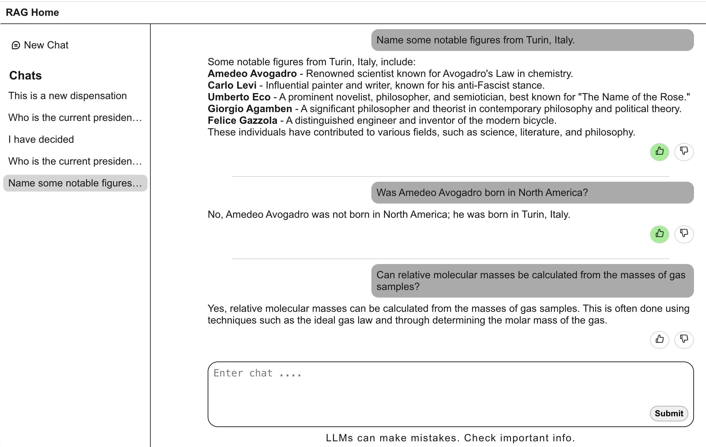
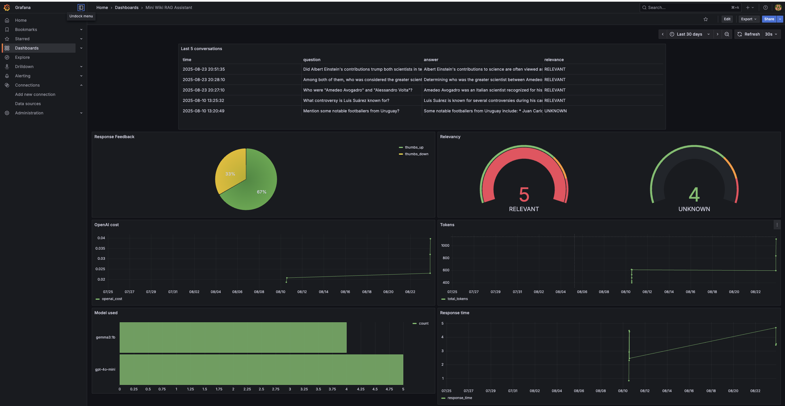

### Problem description
This application provides RAG context for a mini-wikipedia problem. It uses a 
[Question-Answer Dataset](https://www.kaggle.com/datasets/rtatman/questionanswer-dataset/data) 
that was generated using cleaned text from Wikipedia articles. The dataset for different years 
(2008 - 2010) was downloaded as separate text files and cleaned and merged into a single csv.
Preprocessing steps included removing duplicates and simple formatting changes. Check 
[combine_data.py](./combine_data.py) to generate the main dataset. In production I used  `gpt-4o-mini` 
and in development, I used `gemma3:1b` with an ollama server running in a devcontainer with docker.
<br>
Major requirements include python, vscode, docker-compose, and npm.

### Retrieval flow
Data is ingested into a minsearch in-memory index using a python script. For each query, the top 
5 search results from the knowledge base are provided as context to an LLM. The LLM reviews the 
index and provides a response to the query.

### Retrieval evaluation
The retrieval performance is evaluated using the `hit rate` and `MRR`. For each Q-A pair, we 
compare the document ids (`ArticleFile`) in the retrieval response. You can run the workflow in 
the [evaluate_search.py](./backend/evaluate_search.py) script with `poetry run python evaluate_search.py`
```bash
{
  "hit_rate": 1.0,
  "mrr": 0.961
}
```

### LLM evaluation
Only one prompt was used. The rag pipeline with a single prompt was evaluated using 2 different 
models, Gemma3:1b from ollama, and gpt-4o-mini. Offline evaluation used cosine similarity and 
online evaluation relied on a mixture of LLM-as-a-judge, and human feedback. Earlier prompts that 
did not adhere to given context were deleted.
- ***Offline Eval*** - (Cosine similarity between ground truth and llm answers).
- The mean cosine similarity for gemma3:1b is _0.283_
- The mean cosine similarity for gpt-4o-mini is _0.248_

>[!Note]
> Ground truth answers are overly simplified for the dataset including one word answers like yes/no 
without including additional context that the LLM provides which decreases performance metrics. 
<br>

Used LLM as a judge to evaluate RAG pipeline performance.
```
         relevance  count
0         RELEVANT    179
1  PARTLY_RELEVANT     16
2     NON_RELEVANT      5
```

- ***Online Eval*** 
Users can provide feedback to upvote/downvote the returned responses. The production app also uses 
llm as a judge to evaluate a response's relevancy to each query. This can be viewed on the grafana 
dashboard and used to evaluate retrieval/prompt/RAG performance.

### Interface
The app interface is built with a mixture of a fastapi backend api service, and a Next.js frontend 
service. 

- Launch the fastapi server from the backend directory with `poetry run uvicorn app:app --reload`. 
    Additional info on the backend server can be found [here](./backend/Readme.md)
- Launch the Next.js server from the frontend directory with `npm run dev`. Additional info on the 
    frontend server can be found [here](./frontend/README.md)

<div align="center">
  <br>
  <span>UI Interface</span>
</div>
<br>

Conversation history from most recent 3 messages in a conversation is also passed to the prompt to 
maintain context for a conversation style experience. Without this, each query starts with a new 
state and can't follow logic from previous messages. Longer conversation histories consumes tokens 
faster.

### Ingestion pipeline
Data is ingested using a python script when the fastapi server is started.

### Monitoring
Monitoring dashboard implemented with Grafana. To access the grafana dashboard from the local docker 
network, navigate to http://localhost:3500/ in your browser. The dashboard is not implemented on my 
production server because it gives access to my db.
```json
{
  "username": "admin",
  "password": "12345"
}
```
<div align="center">
  <br>
  <span>Grafana Dashboard display</span>
</div>

### Containerization
Locally, every service can be run from the devcontainer, and is connected with docker-compose. On prod, 
the backend server is started with a dockerfile, and the frontend is hosted on vercel. The backend api 
endpoint is passed as an environment variable to the application settings. <br>

Create a `.env` file in the root directory and include the following environment variables
```bash
OPENAI_API_KEY=
DATABASE_URL=
APP_ENV=production
```

**Backend**
- build image `docker build -t rag-be:v1 -f ./backend/Dockerfile .`
- run `docker run --env-file .env -p 8000:8000 -d --rm -t rag-be:v1`. Uses detached mode and allows you to 
  pass in an environment variable file.
- You'll need a valid db for this to work. You can skip to the docker-compose setup if accessing a db is a
  problem.

<br>

**Frontend**
- Create a `./frontend/.env.local` file with 
  ```bash
  NEXT_PUBLIC_API_URL="http://localhost:8000"
  ```
- build image `docker build -t rag-fe:v1 -f ./frontend/Dockerfile .`
- run `docker run -p 3000:3000 -d --rm -t rag-fe:v1`
- Access the server at http://localhost:3000.

<br>

Run both together with ***docker compose***
- build `docker compose build`
- `docker compose up`
- Access the server at http://localhost:3000


### Reproducibility
Use docker in dev container or with docker compose to replicate the application.

### Deployment
This project is deployed on vercel and railway